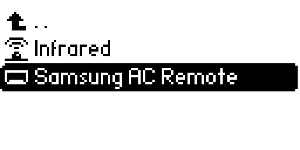
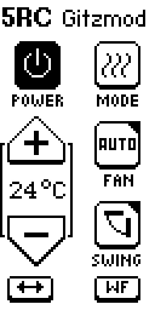
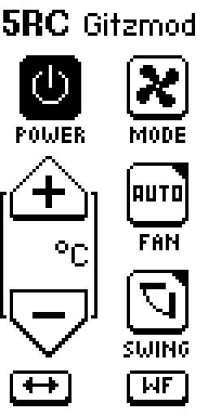
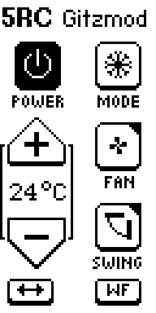
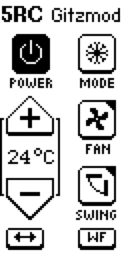
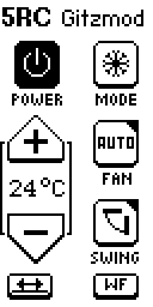
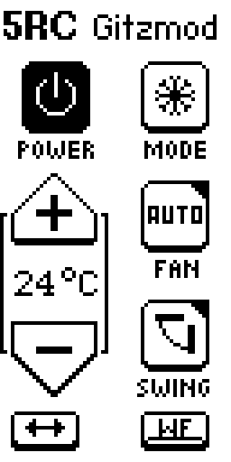
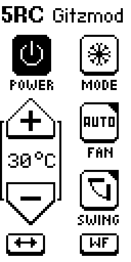

# 5RC Gitzmod — Bedienung

Infrarot-Fernbedienung für Samsung-Klimageräte auf dem Flipper Zero.

Die App ist **zustandsbehaftet**: Samsung kennt keine Einzelbefehle wie „Temperatur +1".
Jeder Tastendruck sendet den **kompletten aktuellen Zustand** — Power, Modus, Temperatur,
Lüfter, Swing und WindFree in einem Frame. Was in der App steht, ist also das, was das
Gerät bekommt.

---

## Starten

Auf dem Flipper: **Apps → Infrared → 5RC Gitzmod**

Die Datei liegt auf der SD-Karte unter `/ext/apps/Infrared/samsung_ac_remote.fap`.

---

## Die Oberfläche

Das Display ist hochkant. Navigation mit dem Steuerkreuz, Auslösen mit **OK**.
Der ausgewählte Button wird invertiert dargestellt (weiß auf schwarz).

Die beiden Buttons in der untersten Zeile zeigen zusätzlich ihren **Ein/Aus-Zustand**:
ist die Funktion aktiv, trägt das Icon einen Balken unter dem Symbol.

---

## Die Buttons

| Button | Funktion |
|---|---|
| **POWER** | Klimagerät ein- / ausschalten |
| **MODE** | Betriebsart durchschalten: Kühlen → Heizen → Entfeuchten → Ventilator → Auto |
| **+ / −** | Solltemperatur, 16–30 °C (siehe Hinweis unten) |
| **FAN** | Lüfterstufe durchschalten: Auto → niedrig → mittel → hoch |
| **SWING** | Vertikaler Swing (Lamellen oben/unten) ein / aus |
| **↔** | Horizontaler Swing (links/rechts) ein / aus |
| **WF** | WindFree ein / aus |

### Wichtig: Tastendrücke bei ausgeschaltetem Gerät

Solange **Power auf „aus"** steht, ändern die anderen Buttons nur die Anzeige in der App —
es wird **nichts gesendet**. Das ist Absicht: du kannst alles vorbereiten und dann mit einem
einzigen Druck auf POWER einschalten.

---

## Power

| | |
|---|---|
|  |  |
| Gerät ist **aus** — Symbol gefüllt | Gerät ist **an** — Symbol als Ring |

---

## Betriebsarten

| Kühlen | Heizen | Entfeuchten |
|---|---|---|
|  |  |  |

| Ventilator | Auto |
|---|---|
|  |  |

Im **Ventilator**-Modus wird keine Temperatur angezeigt — die Anzeige ist leer und die
Tasten + / − sind wirkungslos. Das Gerät regelt dort nicht auf einen Sollwert.

Im **Auto**-Modus entscheidet die Klimaanlage selbst. Nahe am Sollwert läuft sie bewusst
nur mit Umluft. Das fühlt sich wie Ventilatorbetrieb an, ist aber normal und kein Fehler
der App.

---

## Lüfterstufen

| Auto | Niedrig | Mittel | Hoch |
|---|---|---|---|
|  |  |  |  |

---

## Swing und WindFree

| Horizontaler Swing an | WindFree an |
|---|---|
|  |  |

Beide Icons tragen im eingeschalteten Zustand den Balken unter dem Symbol.

### Wie die drei zusammenhängen

Vertikaler und horizontaler Swing liegen im Protokoll in **einem gemeinsamen 3-Bit-Feld**
(aus / nur vertikal / nur horizontal / beides). Die App schreibt deshalb immer beide Achsen
zusammen — sonst würde das Setzen der einen die andere löschen.

**WindFree** akzeptiert das Gerät nur zusammen mit **Lüfter auf Auto** und **vertikalem
Swing aus**. Die App bildet das ab:

- WindFree einschalten → Lüfter springt auf Auto, vertikaler Swing geht aus
- Lüfterstufe ändern oder vertikalen Swing einschalten → WindFree geht aus

Der **horizontale** Swing ist davon nicht betroffen und läuft unabhängig weiter.

---

## Temperatur

Die App erlaubt **16–30 °C**. Das ist der Bereich des Samsung-Protokolls, nicht der jedes
einzelnen Geräts.

> **Bei dieser Anlage ist bei 18 °C Schluss.** Wird ein niedrigerer Sollwert gesendet,
> verwirft das Gerät das Frame und bleibt im vorherigen Zustand stehen. Das sieht dann so
> aus, als würde es „nicht kühlen" oder nur den Ventilator laufen lassen.
> Wenn also nichts passiert: prüfe zuerst, ob die Temperatur unter 18 °C steht.

---

## Einstellungen

Die App merkt sich Modus, Temperatur, Lüfter, beide Swing-Achsen, WindFree und den
Power-Zustand zwischen den Starts, in
`/ext/apps_data/samsung_ac_remote/settings.txt`.

Ältere Dateien ohne die neueren Schlüssel werden weiterhin geladen; fehlende Werte gehen
auf „aus". Werte außerhalb des gültigen Bereichs setzen alles auf die Standardwerte
zurück (Kühlen, 24 °C, Lüfter Auto, alles andere aus).

---

## Bekannte Einschränkung

Beim **Ein- und Ausschalten** sendet die Originalfernbedienung ein längeres Frame aus drei
Sektionen statt zwei (die mittlere ist eine Timer-Sektion). Diese App sendet immer das
kurze Frame. In der Praxis funktioniert das hier; sollte ein Gerät das Ein-/Ausschalten
ignorieren, wäre das die erste Stelle zum Nachsehen.

Timer- und Sleep-Funktionen sind bewusst nicht implementiert.
