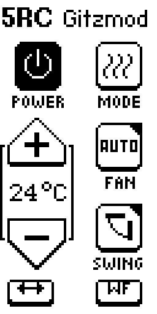
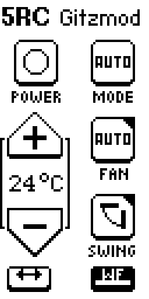
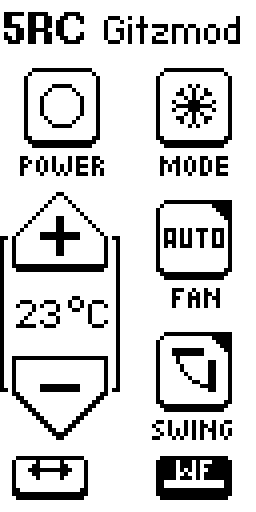
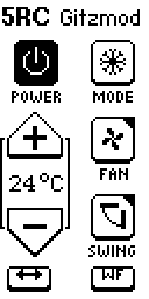
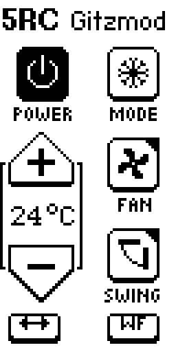
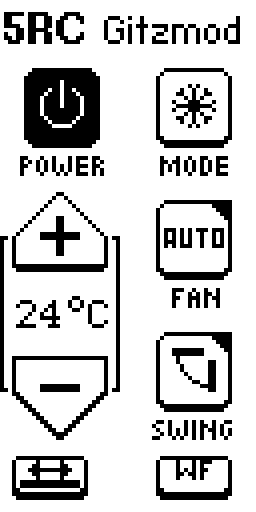
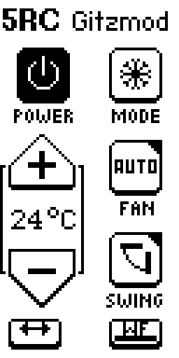
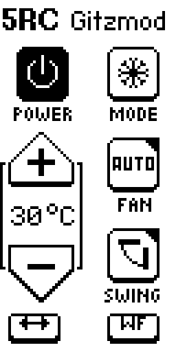

# 5RC Gitzmod — Usage

Infrared remote for Samsung air conditioners, running on the Flipper Zero.

The app is **stateful**: Samsung has no single-shot commands like "temperature +1". Every
button press transmits the **complete current state** — power, mode, temperature, fan, swing
and WindFree in one frame. Whatever the app shows is what the unit receives.

---

## Starting it

On the Flipper: **Apps → Infrared → 5RC Gitzmod**

The file lives on the SD card at `/ext/apps/Infrared/samsung_ac_remote.fap`.

---

## The screen

The display is in portrait orientation. Navigate with the D-pad, act with **OK**.
The selected button is drawn inverted, white on black.

The two buttons in the bottom row also show their **on/off state**: while the setting is
active, the icon carries a bar underneath the glyph.

---

## The buttons

| Button | What it does |
|---|---|
| **POWER** | Turn the unit on / off |
| **MODE** | Cycle the mode: cool → heat → dry → fan → auto |
| **+ / −** | Target temperature, 16–30 °C (see the note below) |
| **FAN** | Cycle the fan speed: auto → low → medium → high |
| **SWING** | Vertical swing (vanes up/down) on / off |
| **↔** | Horizontal swing (left/right) on / off |
| **WF** | WindFree on / off |

### Important: pressing buttons while the unit is off

While **power is off**, the other buttons only change what the app displays — **nothing is
transmitted**. That is deliberate: you can set everything up first and then switch the unit
on with a single press of POWER.

---

## Power

| | |
|---|---|
|  |  |
| Unit is **off** — filled symbol | Unit is **on** — symbol as a ring |

---

## Modes

| Cool | Heat | Dry |
|---|---|---|
|  |  |  |

| Fan | Auto |
|---|---|
|  |  |

In **fan** mode no temperature is shown — the readout is blank and + / − do nothing. The
unit does not regulate to a setpoint there.

In **auto** mode the air conditioner decides for itself. Close to the setpoint it
deliberately just circulates air. That feels like fan mode, but it is normal behaviour and
not a fault of the app.

---

## Fan speeds

| Auto | Low | Medium | High |
|---|---|---|---|
|  |  |  |  |

---

## Swing and WindFree

| Horizontal swing on | WindFree on |
|---|---|
|  |  |

Both icons carry the bar underneath the glyph while the setting is on.

### How the three interact

Vertical and horizontal swing live in **one shared 3-bit field** in the protocol (off /
vertical only / horizontal only / both). The app therefore always writes both axes together
— setting one on its own would clear the other.

The unit only accepts **WindFree** together with **fan on auto** and **vertical swing off**.
The app mirrors that:

- turning WindFree on → fan jumps to auto, vertical swing turns off
- changing the fan speed or enabling vertical swing → WindFree turns off

**Horizontal** swing is unaffected by this and keeps running independently.

---

## Temperature

The app allows **16–30 °C**. That is the range of the Samsung protocol, not of every
individual unit.

> **This unit stops at 18 °C.** Send a lower setpoint and it discards the frame and stays in
> its previous state. That looks as if it were "not cooling" or only running the fan.
> So if nothing happens: check whether the temperature is below 18 °C first.

---

## Settings

The app remembers mode, temperature, fan, both swing axes, WindFree and the power state
between launches, in `/ext/apps_data/samsung_ac_remote/settings.txt`.

Older files without the newer keys still load; missing values default to off. Values outside
the valid range reset everything to the defaults (cool, 24 °C, fan auto, everything else
off).

---

## Known limitation

When **switching on or off**, the original remote sends a longer frame of three sections
instead of two (the middle one is a timer section). This app always sends the short frame.
In practice that works here; if a unit ignores being switched on or off, that would be the
first place to look.

Timer and sleep functions are deliberately not implemented.
